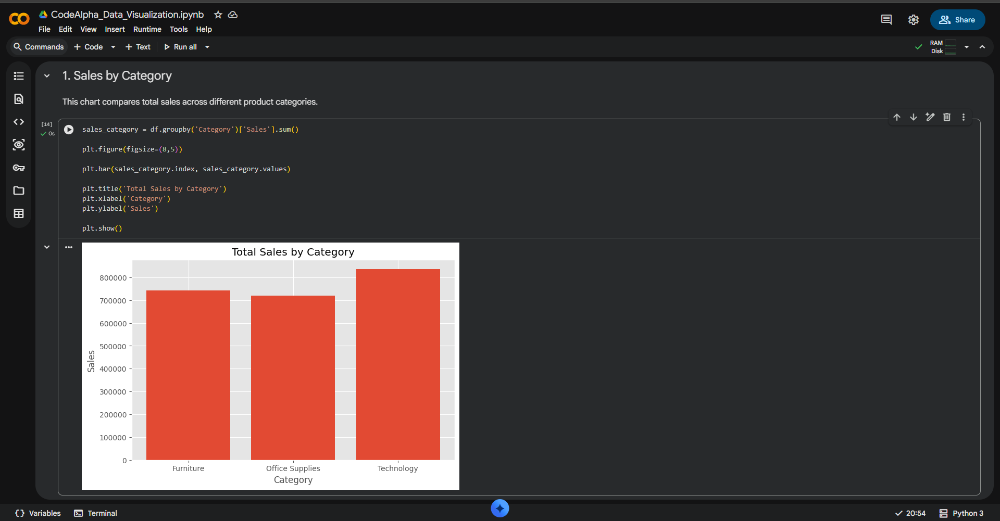
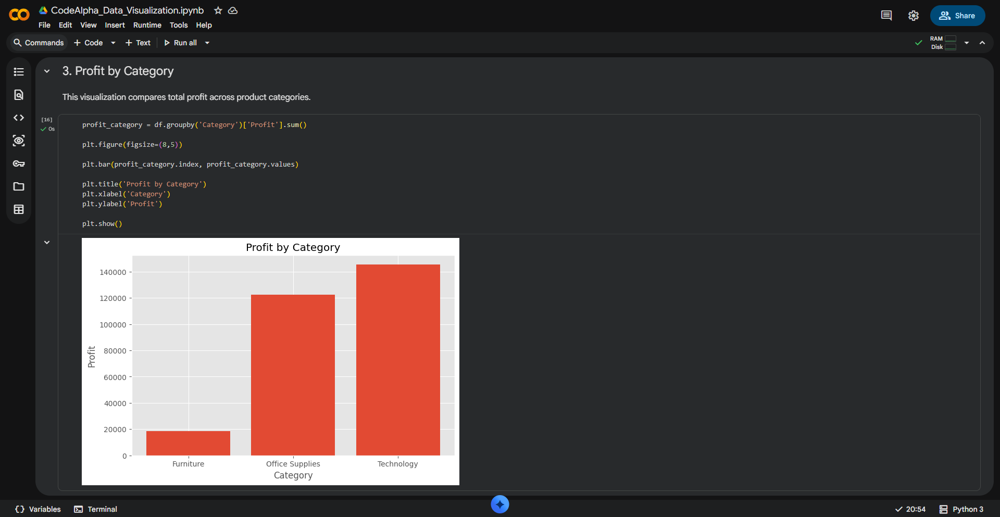
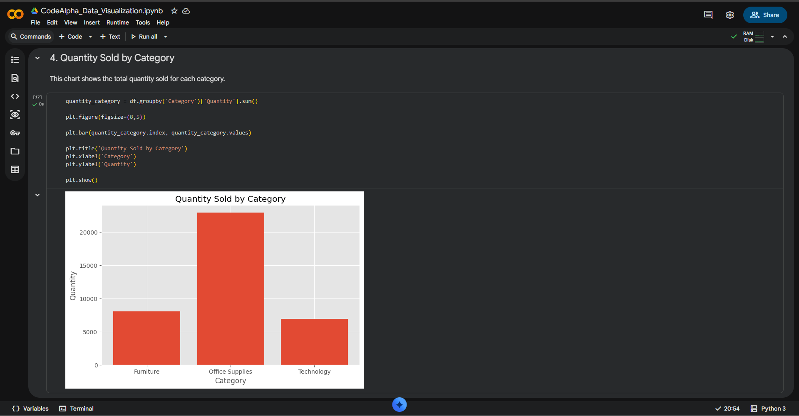
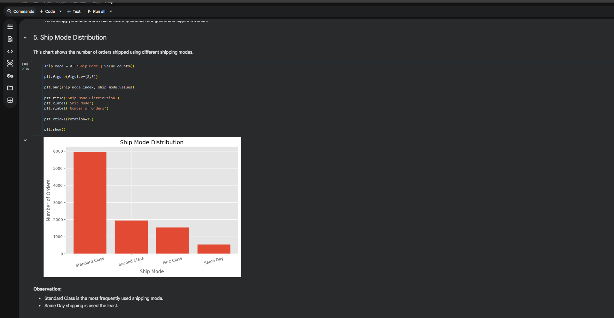
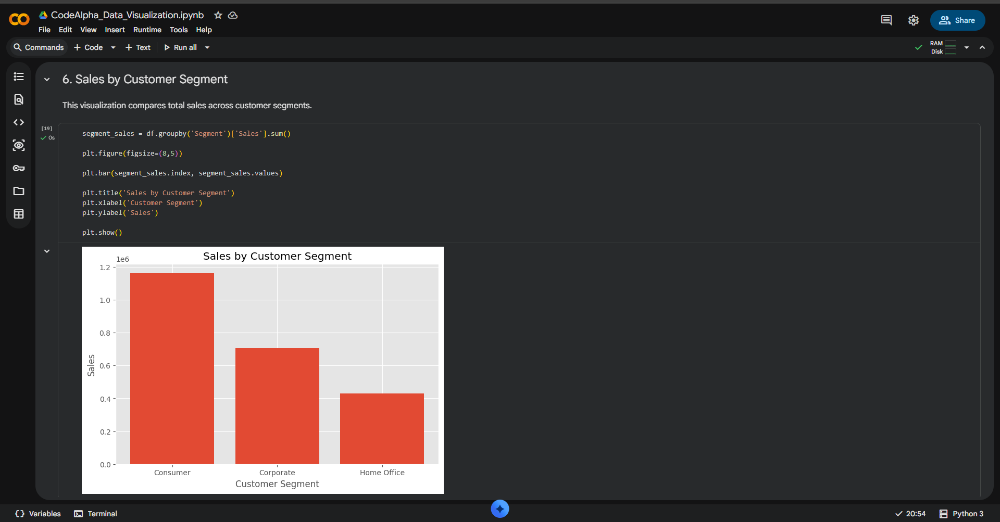
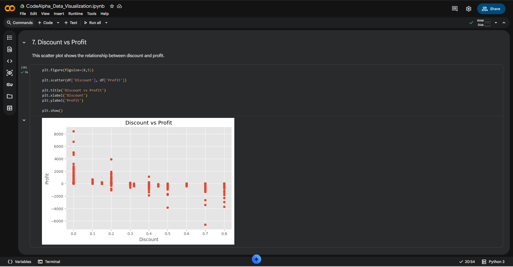
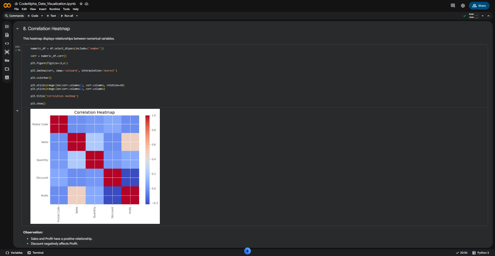
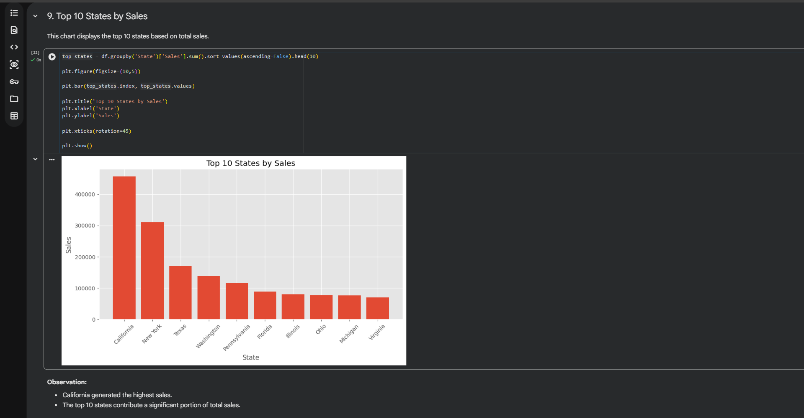
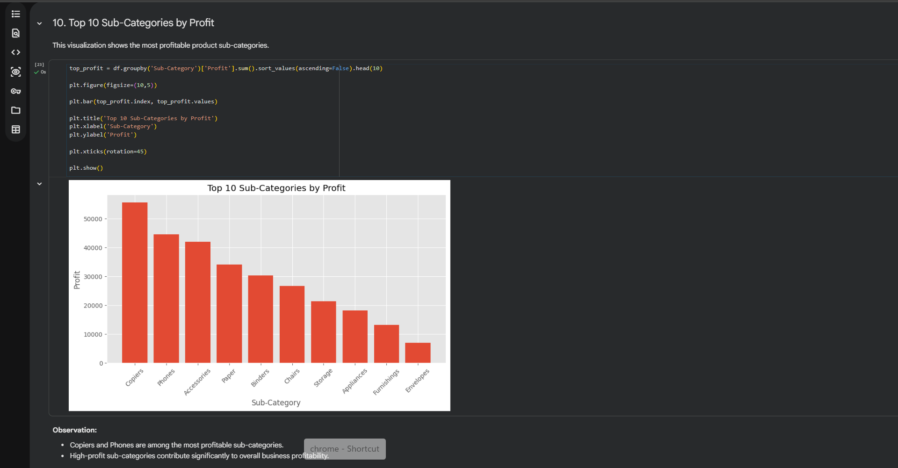
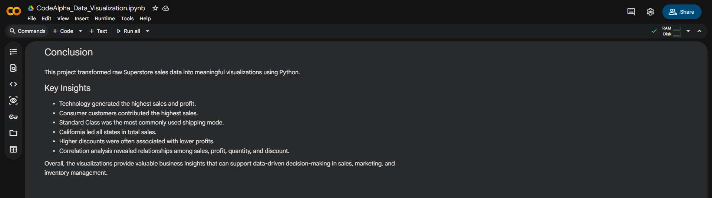

# 📊 Superstore Sales Data Visualization


---

# 📌 Project Overview

This project was completed as part of the **CodeAlpha Data Analytics Internship**.

The objective of this project is to transform raw sales data into meaningful visualizations that help identify business trends, customer behavior, regional performance, and profitability using Python.

---

# 🎯 Objectives

- Explore the Superstore sales dataset
- Create professional business visualizations
- Identify sales and profit trends
- Analyze customer segments and shipping modes
- Discover relationships between business metrics
- Generate actionable business insights

---

# 🛠️ Technologies Used

- Python
- Pandas
- NumPy
- Matplotlib
- Google Colab

---

# 📂 Dataset

- Sample Superstore Dataset (`SampleSuperstore.csv`)

---

# 📈 Visualizations

## 1️⃣ Sales by Category



---

## 2️⃣ Sales by Region


---

## 3️⃣ Profit by Category



---

## 4️⃣ Quantity Sold by Category



---

## 5️⃣ Ship Mode Distribution



---

## 6️⃣ Sales by Customer Segment



---

## 7️⃣ Discount vs Profit



---

## 8️⃣ Correlation Heatmap



---

## 9️⃣ Top 10 States by Sales



---

## 🔟 Top 10 Sub-Categories by Profit



---

# 🔍 Key Findings

- 📈 Technology generated the highest sales and overall profit.
- 👥 Consumer customers contributed the largest share of total sales.
- 🚚 Standard Class was the most frequently used shipping mode.
- 🌍 The West region generated the highest sales.
- 🏆 California recorded the highest sales among all states.
- 💰 Higher discounts often resulted in lower profits.
- 📊 Correlation analysis revealed useful relationships between sales, profit, quantity, and discount.

---

# 📌 Conclusion



This project demonstrates how data visualization can transform raw business data into meaningful insights. By analyzing sales performance, profitability, customer segments, shipping methods, and regional trends, businesses can make informed decisions to improve performance and optimize operations.

---

# 📁 Project Structure

```text
CodeAlpha_Data_Visualization/
│── CodeAlpha_Data_Visualization.ipynb
│── SampleSuperstore.csv
│── README.md
│── requirements.txt
│── sales_by_category.png
│── sales_by_region.png
│── profit_by_category.png
│── quantity_by_category.png
│── ship_mode_distribution.png
│── sales_by_segment.png
│── discount_vs_profit.png
│── correlation_heatmap.png
│── top10_states.png
│── top10_subcategories.png
│── conclusion.png
```

---

# ▶️ How to Run

### Clone the Repository

```bash
git clone https://github.com/kapasrilakshmi075/CodeAlpha_Data_Visualization.git
```

### Install Dependencies

```bash
pip install -r requirements.txt
```

### Open the Notebook

```text
CodeAlpha_Data_Visualization.ipynb
```

Run all cells to reproduce the visualizations and insights.

---

# 📌 Internship Details

**Organization:** CodeAlpha

**Domain:** Data Analytics

**Task:** Data Visualization

---

# 👩‍💻 Author

**Kapa Sri Lakshmi**

🎓 B.Tech Computer Science and Engineering

📊 Aspiring Data Analyst

- **GitHub:** https://github.com/kapasrilakshmi075
- **LinkedIn:** https://www.linkedin.com/in/kapa-srilakshmi-4a0602354/

---

## ⭐ Support

If you found this project useful, consider giving this repository a ⭐.
